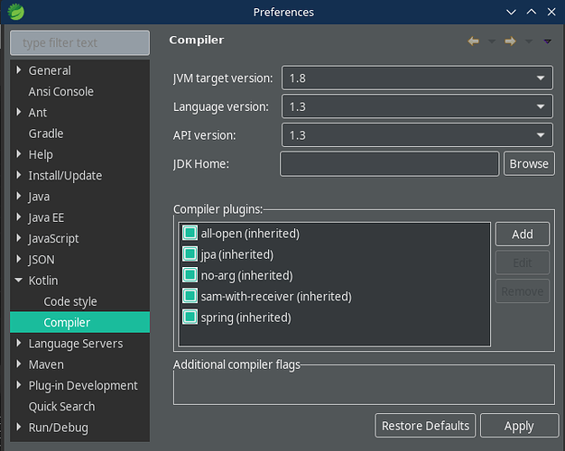

说来惭愧，学习Scala10年后总是感觉不得门而入，后来看到Kotlin才知道，有这样感觉的不止我一人。学习了两天后，感觉Kotlin不仅仅是个更好的Java，也是更好的Scala，当然这里不是想否定Scala，毕竟它是第一个吃螃蟹把Function Programming带入到JVM上来的。Kotlin很明显受到Scala很多影响，无论是语法还是简洁程度，都很相似。促使我最后离开Scala阵营还是看了这篇[文章](https://medium.com/@fommil/scala-almost-succeeded-c3b1028b02c5)，这篇文章提到好几个点都很令人沮丧，最令人沮丧的是Scala 3竟然有要走Python 3的老路，很可能不与Scala 2兼容。未来感觉顿时渺茫。无论怎样，我在Scala里面的学习这几天看来其实也没有白费，因为Kotlin里面的很多概念都是从Scala那边借鉴过来的，所以学习很轻松，同时又没有Scala里面很多学术性的细节。背后又有Jetbrain这颗大树，感觉很放心。现在这种情形有点类似上个世纪90年代的Borland的公司，也是从IDE起家，慢慢开始搞Turbo Pascal, Turbo C,最后搞出牛逼闪闪的C++ Builder，当然 Java Builder就开始走下坡路了。重点在于这个过程还培养并发现了大师级别的人物[Anders_Hejlsberg](https://en.wikipedia.org/wiki/Anders_Hejlsberg)，后来被微软挖去，写出了C#语言。这都是后话，现在的Jetbrain后面也可能有这样的大神，历史将会告诉我们。

废话了这么多，现在进入正题，今天主要学习的是Kotlin在Spring库的帮助下来写Microservice，就是这篇[文章](https://dzone.com/articles/kotlin-microservice-with-spring-boot)。这篇文章其实非常清晰，我还参考了另外一篇[文章](https://kotlinlang.org/docs/tutorials/spring-boot-restful.html),这样，直接基于更简洁的Gradle。不过我还是踩了三个坑，为了便利后人，写下来算是个纪念。

## 文件布局不对导致JVM错误

这个是个愚蠢的错误，自己手工操作，上来就把包名放在`src`目录下面，结果每次`gradle bootRun`老是出下面这样的[错误](https://discuss.gradle.org/t/finished-with-non-zero-exit-value-1-error/23978)

```
Process ‘command ‘C:\Program Files\Java\jre1.8.0_144\bin\java.exe’’ finished with non-zero exit value 1
```
解决问题很简答，只需要把包名放在`src/main/kotlin`即可。

## Swagger要起作用一定要有包名

Kotlin和Spring的整合的时候，由于Spring的`@ComponentScan`[一定要求有包名](https://stackoverflow.com/questions/41729712/spring-application-does-not-start-outside-of-a-package)，如果你的类没有包名，抱歉，你的类就无法被Spring识别和加载。我当时就死活加载不上Swagger2, 老是遇到如下[Swagger ui stuck on unable to infer base url](https://github.com/springfox/springfox/issues/1996)的错误，直到看到[这里]（https://github.com/springfox/springfox/issues/1996#issuecomment-333560017）才明白问题所在。

```kotlin
package your.pakckage.name //don't forget!!!

@Configuration
@EnableSwagger2
class SwaggerConfig {
    @Autowired
    lateinit var build: Optional<BuildProperties>
    @Autowired
    lateinit var git: Optional<GitProperties>
    ...
```

## 基于JVM 1.8的编译竟然导致POST失败

在这篇文章的原文中它用的是

```kotlin
fun main(args: Array<String>) {
    runApplication<SampleSpringKotlinMicroserviceApplication>(*args)
}
```
其实这种写法需要JVM 1.8级别的编译才能运行。Eclipse Kotlin默认的插件1.6是不能用这种写法的，而是应该用比较正统的方式如下：

```kotlin
fun main(args: Array<String>) {
    SpringApplication.run(Application::class.java, *args)
}
```

一开始我还以为没啥大不了的，后来service运行起来才发现，`POST`死活不成功，老说[序列化失败](https://www.reddit.com/r/Kotlin/comments/4wwv38/question_jackson_default_data_class_constructor/),我现在的做法是退回到1.6编译，也就是上面的第二种写法就可以了。不过我想明天试试把下面这三个都加载上看是否能行

```xml
<dependency>
    <groupId>com.fasterxml.jackson.module</groupId>
    <artifactId>jackson-module-kotlin</artifactId>
</dependency>
<dependency>
    <groupId>org.jetbrains.kotlin</groupId>
    <artifactId>kotlin-reflect</artifactId>
</dependency>
<dependency>
    <groupId>org.jetbrains.kotlin</groupId>
    <artifactId>kotlin-stdlib-jdk8</artifactId>
<dependency>
```

## Eclipse 插件要把ALL Open选择上

如[这里](https://kotlinlang.org/docs/reference/compiler-plugins.html#kotlin-spring-compiler-plugin)所说，Kotlin是依赖Kotlin-Spring插件来实现的，在Eclipse的IDE中，确保点选上，如下所示。


